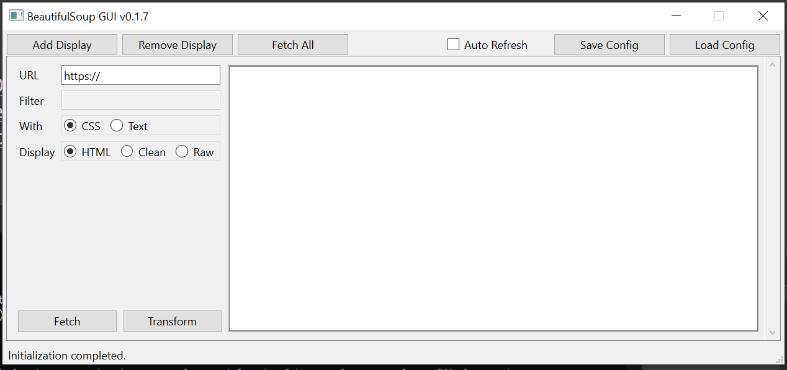

# Beautiful Soup with GUI

How to install and run on Windows:

1. Get the files: git clone https://github.com/HyperUpscale/bs-qt-ui.git
2. Create a virtual environment with: python -m venv bs-qt-ui
3. Go to the directory and activate the virtual environment: cd bs-qt-ui && Scripts\activate   
4. Run the installation requirements: pip install -r requirements.txt
6. run streamlit app and add run "python app.py"

